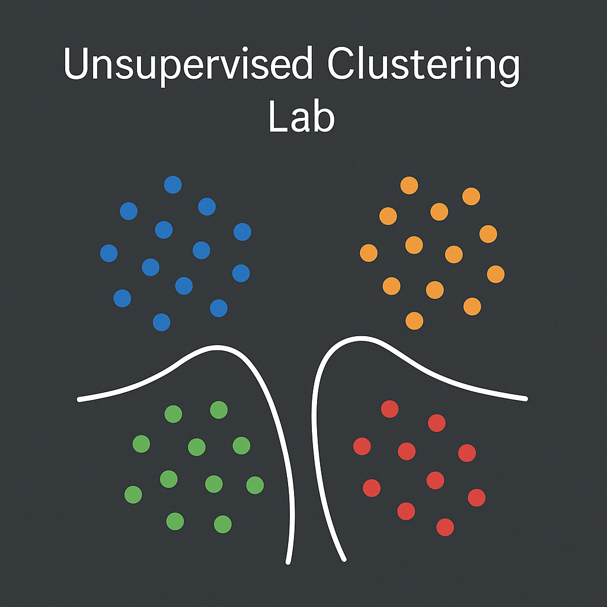

# Clustering Pipeline Project



This project provides a flexible command-line tool for running a variety of clustering algorithms on tabular data. It supports preprocessing, optional cleaning, and evaluation with clear, user-friendly feedback.

## Features
- Multiple clustering algorithms (KMeans, DBSCAN, HDBSCAN, Agglomerative, Spectral, GMM, Autoencoder, etc.)
- Optional data cleaning (by default, cleaning is **skipped**; enable with `--clean`)
- Easy parameterization via the command line
- Outputs cluster assignments to a CSV file
- Helpful error messages and documentation references

## Quick Start
1. **Install dependencies**
   ```bash
   pip install -r requirements.txt
   ```
2. **Run clustering**
   ```bash
   python main.py <csv_file> [algorithm] [param1=value1 ...] [--clean]
   ```
   - `<csv_file>`: Path to your data CSV (required)
   - `[algorithm]`: Clustering algorithm key (optional, defaults to `agglomerative_average`)
   - `[param1=value1 ...]`: Optional algorithm parameters
   - `[--clean]`: Enable cleaning of unrealistic values (default is skipped)

3. **Examples**
   - KMeans: `python main.py data.csv kmeans n_clusters=4`
   - DBSCAN: `python main.py data.csv dbscan eps=0.5 min_samples=5`
   - Default (hierarchical average, no cleaning): `python main.py data.csv`
   - With cleaning: `python main.py data.csv --clean`

4. **See** [`GUIDE.md`](./GUIDE.md) for full documentation, algorithm list, and troubleshooting.

## Project Structure
- `main.py` — Main entry point for clustering and evaluation
- `preprocessing.py` — Data cleaning and preprocessing utilities
- `clustering_algorithms/` — Contains implementations for each clustering method
- `requirements.txt` — Python dependencies
- `.gitignore` — Ignores CSV files, cache, and system files
- `GUIDE.md` — Complete usage guide and examples

## Tips
- All output cluster assignments are saved as `<algorithm>_clusters.csv`.
- If you encounter errors, check the error message for a reference to `GUIDE.md`.
- Data and result CSV files are ignored by git by default.

---

**Happy clustering!**
